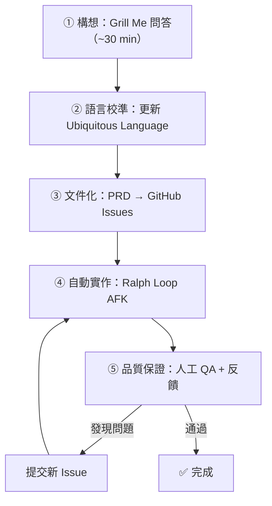

# Claude Code 工程工作流

## 核心理念

> 「這不是新的典範轉移——過去 20 年軟體工程的最佳實踐，在 AI 工具裡依然是最有效的。」

把 AI 當成團隊中可以委派工作的成員：
- **你負責**：架構決策、回饋迴圈設計、需求精煉、品質審查
- **AI 負責**：程式碼實作、測試撰寫、Bug 修復、文件摘要

## 五階段工作流

| 階段 | 耗時 | 執行者 | 詳細頁面 |
|------|------|--------|----------|
| ① 構想精煉 | ~30 min | 人 + AI 對話 | [Grill Me](grill-me-skill.md) |
| ② 語言校準 | ~5 min | AI 提議 → 人審核 | [Ubiquitous Language](ubiquitous-language.md) |
| ③ 文件化 | ~10 min | AI 撰寫 → 人調整粒度 | [PRD 到 Issues](prd-to-issues-pipeline.md) |
| ④ 自動實作 | ~1.5 hr | AI（AFK） | [Ralph Loop](ralph-loop-afk-agent.md) |
| ⑤ 品質保證 | ~20 min | 人 QA → AI 修復 | [QA 回饋迴圈](qa-feedback-loop.md) |

## 關鍵原則

### 審查輸入與輸出，而非逐行程式碼

> 「我做的是審查 AI 的輸出、傳入更多資訊、然後跟它進入一個緊密的迴圈。」

開發者應關注：
- **介面設計**：模組的 public API 是否乾淨、可測試
- **模組邊界**：變更是否跨越了不該跨越的邊界
- **功能正確性**：實際跑起來的行為是否符合預期

### 信任 AI 的摘要能力

PRD 是 Grill Me 對話的直接衍生品——AI 非常擅長摘要，可以直接接受 PRD 內容而不逐行審查。但 **Issue 粒度** 和 **QA 結果** 必須由人類把關。

### 每次 Commit 都要通過測試

Ralph Loop 的每一輪迭代都必須執行測試套件和型別檢查。這是整個系統的「護欄」。

## 實戰案例概要

影片中展示的完整案例——為「Course Video Manager」新增 Ghost Course 功能：

| 指標 | 數據 |
|------|------|
| Grill Me 時長 | ~22 分鐘（得到 8 個核心需求點） |
| Context Window 消耗 | ~40K tokens（使用 Explore 子代理節省） |
| Ralph Loop 迭代 | 初始 5 次 → QA 後再 8 次 |
| 總 Commit 數 | ~14 個 |
| QA 發現問題 | 6 個 Issue（含 bug 與 UX 改進） |
| 總耗時 | ~42 分鐘人工時間 + ~2 小時 AI 背景執行 |

## 適用技術棧（案例中使用）

- React Router + TypeScript + Node.js
- Drizzle ORM + PostgreSQL
- **Effect**（TypeScript 函數式框架）——用於建立可測試的服務模組
- Vitest 測試（含 e2e 測試：建立臨時 DB + Git repo）
- 本機執行（不部署）

## 相關概念

- [Day Shift / Night Shift 模型](day-night-shift-model.md) — 人 AI 並行工作的哲學框架
- [Explore 子代理](explore-subagent.md) — Token 高效的代碼庫探索機制

---
> **來源**：[原始逐字稿](../processed/20260407 claude_code_dev.md)
