# Day Shift / Night Shift 模型

## 定義

一種將人類與 AI 工作「解耦」的開發哲學——人類做日班（構想 + 審查），AI 做夜班（實作 + 修復），兩者**同步運轉、互不阻塞**。

> 此命名由 Twitter 用戶 **Jamon** 提出。

## 運作方式

```mermaid
gantt
    title 一天的工作節奏
    dateFormat HH:mm
    axisFormat %H:%M

    section 🌞 人類（日班）
    Grill Me 功能 A        :a1, 09:00, 30min
    散步 + 喝茶             :a2, 09:30, 90min
    QA 功能 A              :a3, 11:00, 20min
    Grill Me 功能 B        :a4, 11:20, 30min
    午餐                    :a5, 12:00, 60min
    QA 功能 B              :a6, 13:00, 20min

    section 🌙 AI（夜班）
    Ralph Loop 功能 A      :b1, 09:30, 90min
    修復功能 A 的 Bug      :b2, 11:20, 30min
    Ralph Loop 功能 B      :b3, 12:00, 60min
    修復功能 B 的 Bug      :b4, 13:20, 30min
```



| 班次 | 執行者 | 工作內容 |
|------|--------|----------|
| 🌞 日班 | 人類 | [Grill Me](grill-me-skill.md)、架構決策、[PRD](prd-to-issues-pipeline.md) 審核、[QA](qa-feedback-loop.md) |
| 🌙 夜班 | AI | [Ralph Loop](ralph-loop-afk-agent.md)：實作 Issue、寫測試、修 Bug、commit |

## 為什麼不「慢」

> 「很多人說這個方法太慢了。你需要理解的是——在你做 Grill Me 的同時，上一輪的 Ralph Loop 正在背景跑。」

人類的稀缺資源是 **決策力**，不是打字速度：

```
人類真正在做的只有兩件事：
  1. 定義需求（What & Why）—— AI 做不到
  2. 驗收品質（QA）         —— AI 做不好

中間的所有實作 → 全部委派給 AI
```

## 核心洞察

> 「一旦我們完成了想法的思考，我們的工作基本上就結束了——直到需要 QA 輸出為止。」

影片案例中的時間分配：
- **人工耗時**：~42 分鐘（Grill Me 30min + QA 12min）
- **AI 背景耗時**：~2 小時
- **人的「閒置」時間**：散步、喝茶、跟父母聊天、開始下一個功能的 Grill Me

## 為什麼循序 Ralph Loop 反而是好的

並行 Agent 在理論上更快，但循序模式製造了**深度思考的空檔**：

> 「坦白說，有這些空檔還蠻好的——因為我可以做深度專注的工作，比如開始下一個 Grill Me 環節。」

這些空檔不是浪費時間，而是人類做最高價值工作（構想 + 決策）的時間。

## 相關概念

- [Ralph Loop](ralph-loop-afk-agent.md) — 「夜班」的執行引擎
- [QA 回饋迴圈](qa-feedback-loop.md) — 「日班」的核心工作
- [Grill Me](grill-me-skill.md) — 「日班」的起點
- [Claude Code 工程工作流](claude-code-workflow.md) — 總覽

---
> **來源**：[原始逐字稿](../processed/20260407 claude_code_dev.md)
