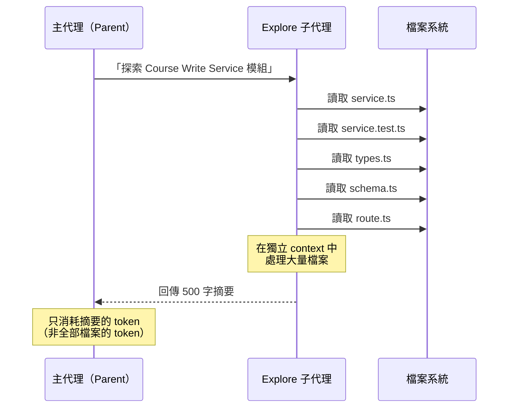

# Explore 子代理機制

## 定義

Claude Code 中的內建機制。主代理將「探索代碼庫」委派給一個**獨立的子代理**，子代理在自己的 context window 中大量讀取檔案，然後只回傳精簡摘要。

## 運作原理

## 為什麼重要

### Token 效率

- 子代理可以讀取數十個檔案（消耗大量 token）
- 主代理只接收一份摘要（消耗極少 token）
- 案例中，22 分鐘的 Grill Me + PRD 撰寫，主代理的 context window 才消耗 ~40K tokens

### Context 隔離

子代理的完整讀取不會污染主代理的 context window，避免不必要的 token 膨脹。

## 使用時機

| 場景 | 誰發起 | 頻率 |
|------|--------|------|
| [Grill Me 開始前](grill-me-skill.md) | AI 自動發起 | 每次 session 至少 1 次 |
| [PRD 撰寫時](prd-to-issues-pipeline.md) | AI 自動發起 | 需要確認模組邊界時 |
| AI 需要回答「程式碼中是否已有某功能」 | AI 按需發起 | 不定 |

## 實務觀察

### 速度是痛點

> 「我真希望 Explore 更快一點。每個 session 都需要用到它，有時候一個 session 要用好幾次。」

### AI 可能會漏看

案例中 AI 聲稱「Course Write Service 沒有測試套件」，但實際上測試存在且很完整——開發者回覆「look harder」後才找到。

**→ Explore 的結果不是 100% 可靠，人類需要有判斷能力。**

## By The Way（附帶問題功能）

影片中提到 Claude Code 的另一個相關功能：**Side Question**（按空格 + Enter 觸發）。
- 用於快速問一個不進入主對話歷史的問題
- 例如：「描述一下 Course Write Service 的結構」
- 答完後按 Escape 回到主對話

這和 Explore 不同：Side Question 是人主動問的快速查詢，Explore 是 AI 系統性的深度探索。

## 相關概念

- [Grill Me](grill-me-skill.md) — Explore 最常在 Grill Me 開始時被觸發
- [Claude Code 工程工作流](claude-code-workflow.md) — Explore 貫穿整個工作流

---
> **來源**：[原始逐字稿](../processed/20260407 claude_code_dev.md)
