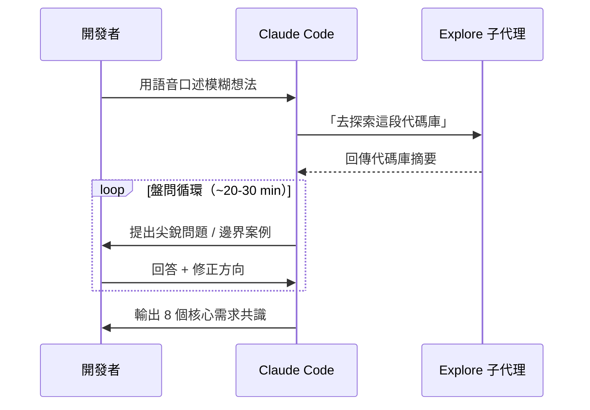

# Grill Me — AI 問答精煉法

## 定義

一種 Claude Code 自訂技巧（Skill），讓 AI 在你寫任何程式碼之前，**主動盤問**你的模糊需求，直到想法被精煉到可以直接生成 PRD 的程度。

## 為什麼需要它

每天的開發工作通常從「模糊的想法」開始：

> 「課程管理的刪除流程太麻煩了，應該可以直接…… 然後我還想加一個新東西……」

如果直接讓 AI 寫程式碼，結果會充滿假設和遺漏。Grill Me 先把想法「壓力測試」到位。

## 運作機制

### 三大機制特色

1. **Explore 先行**：AI 不是憑空猜測——它先透過[子代理](explore-subagent.md)讀取代碼庫，然後基於真實程式碼結構來提問
2. **Code-First 回答**：如果問題可以從程式碼得到答案，Skill 要求 AI 先看程式碼再問人（例：「後端已經支援直接刪除了，是 UI 層的限制嗎？」）
3. **共置問答（Collocation）**：問題和答案緊鄰在 context 中，讓 Transformer 的注意力機制能同時「看到」兩者

### 為什麼不用 `ask_user_question` 工具

- 每次呼叫工具需包裝 JSON → 浪費 token
- 聊天流的 UX 更自然
- 總體 token 效率更高

## AI 問題的類型與品質

> 「我以前的老闆 Willow Reagan 有一種不可思議的能力——在會議中連續問幾小時的聰明問題。AI 正在做完全一樣的事。」

| 問題類型 | 範例 |
|----------|------|
| **挑戰假設** | 「程式碼裡已經能直接刪除了，痛點真的是後端嗎？」 |
| **邊界案例** | 「刪除所有真實課程後，Course 要自動變成 Ghost 嗎？」 |
| **語義探測** | 「Ghost Course 沒有檔案系統，那 『真實課程』 在這裡是什麼意思？」 |
| **權衡分析** | 「方案 A 保持純規劃空間 vs 方案 B 觸發實體化串聯，各有什麼利弊？」 |
| **串聯推理** | 「在 Ghost Course 裡按 Create Real Lesson，要直接觸發整個實體化流程嗎？」 |

## 使用技巧

- 預留 **30 分鐘**進行一次完整環節
- 用**語音口述**輸入初始想法（更自然流暢）
- 一定要解釋 **Why**（為什麼要這個功能），不只是 What —— 讓 AI 有能力建議替代方案
- 允許角色切換：AI 主導提問 ↔ 人主導探索方向
- 完成後立即更新 [Ubiquitous Language](ubiquitous-language.md)

## 輸出成果

一次 22 分鐘的 Grill Me 環節產出了 **8 個具體需求點**：

1. `file_path` 改為 nullable（Schema 變更）
2. Ghost Course 建立流程（只需名稱，不需路徑）
3. Ghost Course UI（隱藏 Publish / Export）
4. 真實課程裡的「Create Real Lesson」按鈕（直接在磁碟建立）
5. Ghost Course 裡的「Create Real Lesson」→ 觸發 Modal 選擇路徑 → 實體化串聯
6. 「Create Ghost Lesson」維持現有行為
7. 「Delete Real Lesson」→ 同時清除磁碟 + 資料庫
8. 「Convert to Ghost」保留（用於保留規劃但移除磁碟表示）

## 相關概念

- [Claude Code 工程工作流](claude-code-workflow.md) — Grill Me 是流程的第一步
- [Ubiquitous Language](ubiquitous-language.md) — Grill Me 產出的術語要寫入此文件
- [PRD 到 Issues 管線](prd-to-issues-pipeline.md) — Grill Me 的下游

---
> **來源**：[原始逐字稿](../processed/20260407 claude_code_dev.md)
