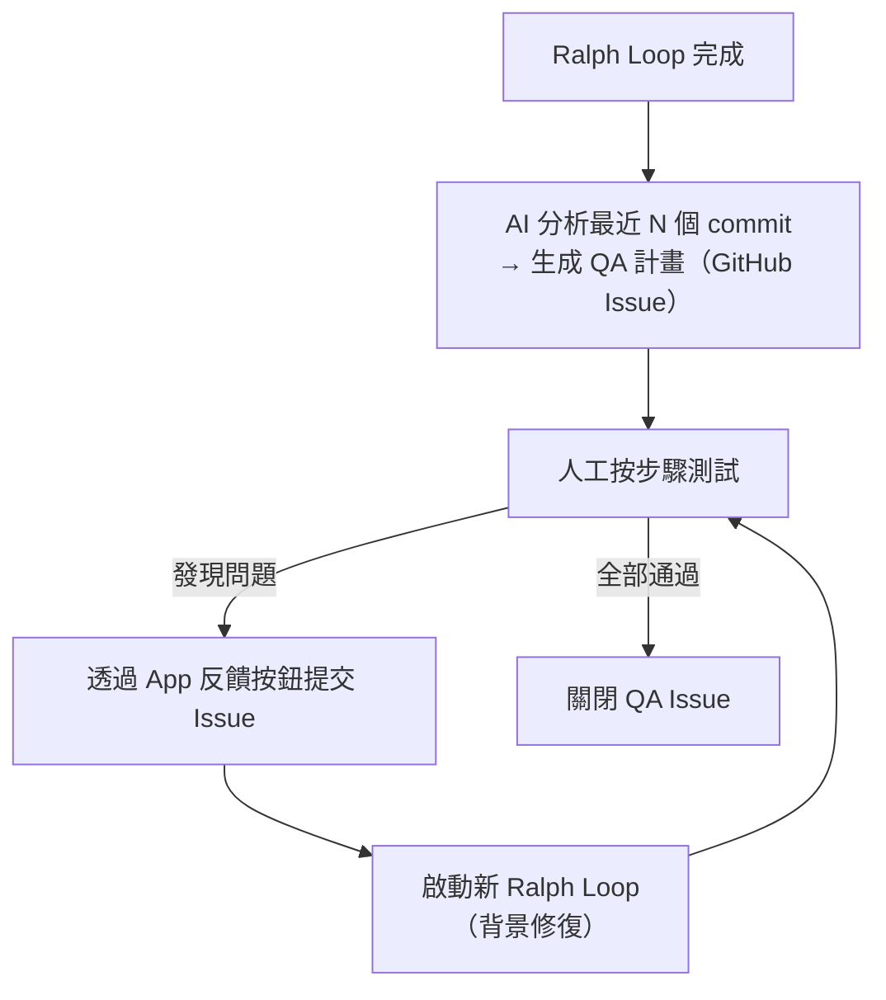

# QA 回饋迴圈

## 定義

[Ralph Loop](ralph-loop-afk-agent.md) 完成後的人工品質保證流程。核心特色是 **QA 與修復同步並行**：人在測試的同時，AI 在背景修復已提交的 bug。

## 流程



## 第一步：生成 QA 計畫

啟動一個新的 Claude Code session，下達指令：

```
Take the last 5 commits and create a QA plan for me.
Save that QA plan in a GitHub issue.
The QA plan should give me a step-by-step guide on how to test 
every single part of the new implementation.
```

QA Issue 的作用：
- 給人類一份結構化的測試清單
- 完成後**關閉它**以移出 Ralph 的 context，避免干擾後續工作
- 需要重新 QA 時可重新開啟

## 第二步：App 內反饋按鈕（DX 巧思）

影片中的 App 內建了一個 **反饋按鈕**，開發者可以：
1. 口述或打字描述問題
2. 自動附帶當前路由和錯誤訊息
3. 使用 **Haiku** 模型自動生成 Issue 標題
4. 一鍵推送至 GitHub Issues

> 8 分鐘內創建了 6 個 QA Issue。

## 第三步：並行修復

```mermaid
gantt
    title QA 與修復並行
    dateFormat HH:mm
    axisFormat %H:%M

    section 人類（QA）
    測試功能 1-3          :a1, 10:00, 8min
    測試功能 4-6          :a2, 10:08, 8min
    驗證修復結果          :a3, 10:28, 10min

    section AI（Ralph Loop）
    修復 Issue 1-2        :b1, 10:04, 12min
    修復 Issue 3-4        :b2, 10:16, 12min
    修復 Issue 5-6        :b3, 10:28, 12min
```



每提交幾個 Issue，就啟動一次 `pnpm ralph`，讓修復在背景進行。

## QA 中常見的發現類型

| 類型 | 案例 |
|------|------|
| 🐛 **Bug** | 建立 Ghost Course 後不跳轉新頁面、Modal 不關閉、React minified error |
| 🎨 **UX 問題** | 「Ghost Course」術語不該出現在 UI 中；缺少按鈕 Loading 狀態 |
| ⚠️ **邊界案例** | 目標路徑不是 Git repo → 應回滾已建立的目錄（磁碟與 DB 失去同步） |
| ✋ **確認缺失** | 刪除 Real Lesson 時缺少確認 Modal |
| 💡 **設計改進** | 兩個按鈕（Create Ghost / Create Real）→ 改為一個按鈕 + 勾選框 |

## 關鍵洞察：為什麼 Spec-to-Code 不夠

> 「這種東西讓我確信 spec-to-code 方法永遠不會成功。在 QA 迴圈中、在實際迭代中，你會發現各種奇怪的邊界案例——這些在事前幾乎不可能規劃到。」

例如：「如果 Course 目錄不是 Git repo，整個實體化流程會進入奇怪的失去同步狀態」——這個 edge case 在 Grill Me 階段完全沒被想到，只有在實際操作時才浮現。

## 相關概念

- [Ralph Loop](ralph-loop-afk-agent.md) — QA 的上游（AI 實作結果的來源）
- [Day Shift / Night Shift 模型](day-night-shift-model.md) — QA 是人類「日班」的核心工作
- [Claude Code 工程工作流](claude-code-workflow.md) — QA 是工作流的第五步

---
> **來源**：[原始逐字稿](../processed/20260407 claude_code_dev.md)
