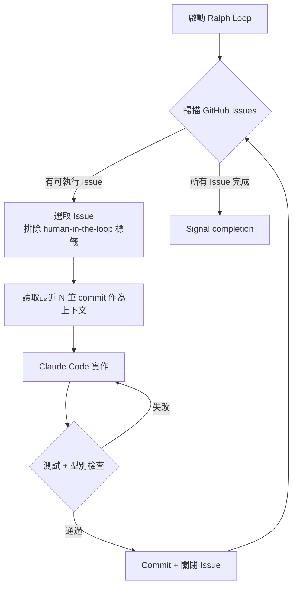

# Ralph Loop — AFK 自動代理

## 定義

一種讓 Claude Code 自主消化 GitHub Issues 的迭代式代理迴圈。啟動後開發者可以離開（AFK = Away From Keyboard），代理會自動選取 Issue → 實作 → 提交 → 關閉 → 下一個。

## 技術架構：Sand Castle

代理運行在 Docker 容器中，暫定專案名為 **Sand Castle**。

```
sandcastle/
├── Dockerfile      # 隔離執行環境
└── prompt.md       # 代理行為設定
```

### 關鍵設計

| 設計決策 | 原因 |
|----------|------|
| Docker 隔離 | 防止代理對本機環境造成不可逆損害 |
| Patch 輸出 | 容器內的 commit 以 patch 提取 → 套用到本機 repo，開發者保有最終審核權 |
| 掛載工作目錄 | 代理可以直接讀寫專案檔案 |

## 執行方式

```bash
pnpm ralph          # 啟動，預設 max iterations = 100
```

## 迭代行為



### 每次迭代的細節

1. 拉取所有開放的 GitHub Issues
2. 根據 `blocked by` 關係選取可執行的 Issue
3. **排除**帶有 `human-in-the-loop` 標籤的 Issue
4. 讀取最近 N 筆 commit 當上下文
5. 實作功能 / 修復 Bug / 撰寫測試
6. **核心護欄**：每次 commit 必須通過測試 & 型別檢查
7. 關閉 Issue → 進入下一輪

## 實戰數據

| 指標 | 初始建造 | QA 修復 |
|------|----------|---------|
| 迭代次數 | 5 | 8 |
| Commit 數 | 6 | 8 |
| Issues 處理 | 4 | 6 |
| 耗時 | ~1.5 小時 | ~30 分鐘 |

總計：**14 個 commit** 構成一個完整功能。

## 為什麼不並行？

作者考慮過多代理並行，但目前循序模式的好處是：

> 「在等待的空檔，我可以做深度思考——比如開另一個終端機進行下一個 Grill Me 環節。」

這正是 [Day Shift / Night Shift 模型](day-night-shift-model.md) 的體現。

## Commit 品質控制

Ralph Loop 內建的品質保證：
- 每次 commit 自動跑測試套件
- 多數迭代中 AI 也會**主動新增測試**（例如更新 reducer test 來覆蓋新 action）
- 留下詳細的 commit messages

## 相關概念

- [QA 回饋迴圈](qa-feedback-loop.md) — Ralph Loop 的下游驗證機制
- [PRD 到 Issues 管線](prd-to-issues-pipeline.md) — Ralph Loop 的上游任務來源
- [Day Shift / Night Shift 模型](day-night-shift-model.md) — Ralph Loop 的哲學框架

---
> **來源**：[原始逐字稿](../processed/20260407 claude_code_dev.md)
